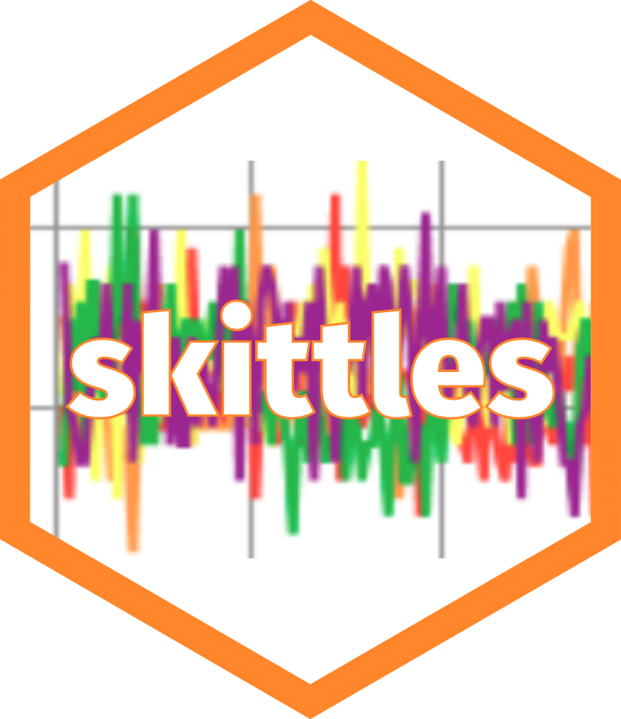

# skittles

## Dataset of Skittles pack colour counts with a pair of identical packs



This repository provides the famous ['skittles' experiment][pw2] dataset as an
  R package.
  The package provides the dataset in two versions:

  * skittles (tidy, tibble)
  * skittles_raw (raw, data.frame)

To access the data in `R`:

```r
remotes::install_github("francisbarton/skittles")
library(skittles)
skittles # or skittles_raw
```

Columns 2-7 of the `skittles` dataset are the original data from Possibly
  Wrong, with the column names converted to lower case.

I added a "pack_id" key field as column 1, which is just the row number
 zero-padded to a 3-digit character.
 (This is to avoid it being mistaken for a numeric data field.)

The package also provides:

* [skittles.csv](inst/extdata/skittles.csv)
* [skittles_raw.tsv](inst/extdata/skittles_raw.tsv)


This fork retains the original [UNLICENSE][unl] from Possibly Wrong's
  [GitHub repo][gh].
  Props to them for their *fruit*ful research, and for making the dataset freely
  available. Sweet.

[pw2]: https://possiblywrong.wordpress.com/2019/04/06/follow-up-i-found-two-identical-packs-of-skittles-among-468-packs-with-a-total-of-27740-skittles/
[pw1]: https://possiblywrong.wordpress.com/2019/01/09/identical-packs-of-skittles/
[gh]: https://github.com/possibly-wrong/skittles
[unl]: https://unlicense.org
